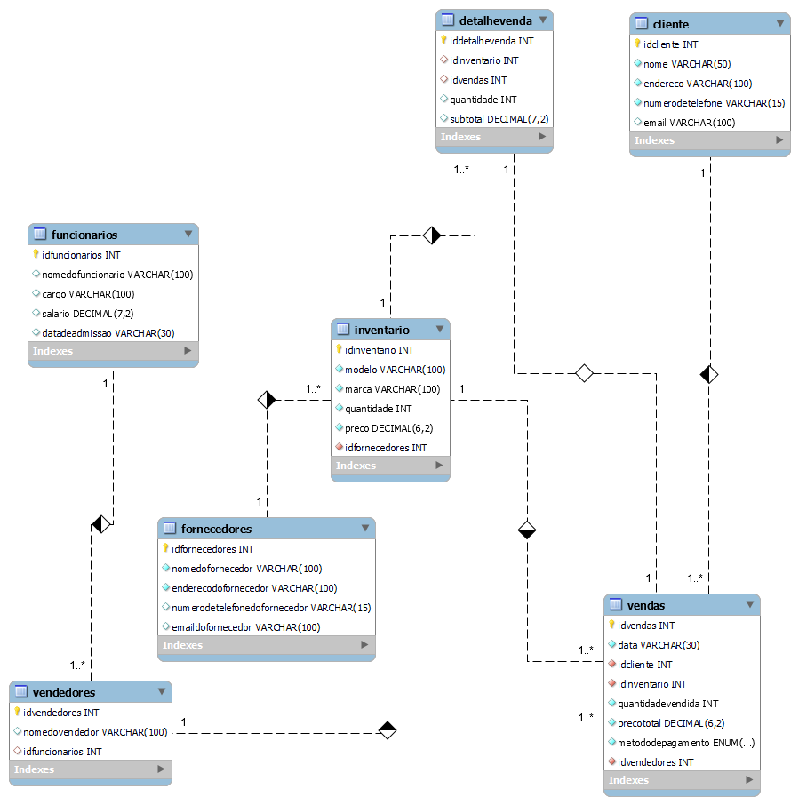
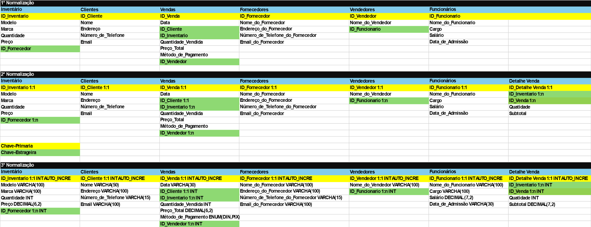

#### Primeiro diagrama



#### Esquema de tabela para o banco de dados


#### Moodelo Fisico: codigo que gera o banco de dados

```sql

CREATE DATABASE bikeshop;

USE bikeshop;

CREATE TABLE inventario(
idinventario int auto_increment primary key,
modelo varchar(100) not null,
marca varchar(100) not null,
quantidade int not null,
preco decimal(6,2) not null,
idfornecedores int not null
);
CREATE TABLE cliente(
idcliente int auto_increment primary key,
nome varchar(50) not null,
endereco varchar(100) not null,
numerodetelefone varchar(15) not null,
email varchar(100)
);
CREATE TABLE vendas(
idvendas int auto_increment primary key,
data varchar(30) not null,
idcliente int not null,
idinventario int not null,
quantidadevendida int not null,
precototal decimal(6,2) not null,
metododepagamento enum("dinheiro","pix","cartao") not null,
idvendedor int not null
);
CREATE TABLE fornecedores(
idfornecedores int auto_increment primary key,
nomedofornecedor varchar(100) not null,
enderecodofornecedor varchar(100) not null,
numerodetelefonedofornecedor varchar(15),
emaildofornecedor varchar(100)
);
CREATE TABLE vendedores(
idvendedores int auto_increment primary key,
nomedovendedor varchar(100),
idfuncionario int
);
CREATE TABLE funcionarios(
idfuncionarios int auto_increment primary key,
nomedofuncionario varchar(100),
cargo varchar(100),
salario decimal(7,2),
datadeadmissao varchar(30)
);
CREATE TABLE detalhevenda(
iddetalhevenda int auto_increment primary key,
idinventario int,
idvendas int,
quantidade int,
subtotal decimal(7,2)
);

ALTER TABLE inventario ADD CONSTRAINT `fk.inventario_pk.fornecedores`
FOREIGN KEY inventario(`idfornecedores`) REFERENCES fornecedores(`idfornecedores`);

ALTER TABLE vendas ADD CONSTRAINT `fk.vendas_pk.cliente`
FOREIGN KEY vendas(`idcliente`) REFERENCES cliente(`idcliente`);

ALTER TABLE vendas ADD CONSTRAINT `fk.vendas_pk.inventario`
FOREIGN KEY vendas(`idinventario`) REFERENCES inventario(`idinventario`);

ALTER TABLE vendas ADD CONSTRAINT `fk.vendas_pk.vendedores`
FOREIGN KEY vendas(`idvendedores`) REFERENCES vendedores(`idvendedores`);

ALTER TABLE vendedores ADD CONSTRAINT `fk.vendedores_pk.funcionarios`
FOREIGN KEY vendedores(`idfuncionarios`) REFERENCES funcionarios(`idfuncionarios`);

ALTER TABLE vendedores ADD CONSTRAINT `fk.vendedores_pk.funcionarios`
FOREIGN KEY vendedores(`idfuncionarios`) REFERENCES funcionarios(`idfuncionarios`);

ALTER TABLE detalhevenda ADD CONSTRAINT `fk.detalhevenda_pk.inventario`
FOREIGN KEY detalhevenda(`idinventario`) REFERENCES inventario(`idinventario`);

ALTER TABLE detalhevenda ADD CONSTRAINT `fk.detalhevenda_pk.vendas`
FOREIGN KEY detalhevenda(`idvendas`) REFERENCES vendas(`idvendas`);
